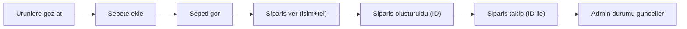

# Taboo Adult Store - Proje Plani

## Teknoloji

- **Next.js 16** (App Router) + **TypeScript** + **Tailwind CSS v4**
- **Supabase** (DB + RLS)
- **Vercel** deploy

## Tema

- Koyu mor/siyah arka plan (#0d0a14, #1a1025 gibi)
- Accent: mor/magenta (#9333ea, #a855f7)
- potheadscauldron.design'dan ilham: minimalist, serif basliklar, temiz layout

## Veritabani (Supabase)

### Tablolar

- **products**: id, name, description, price, image_url, category, in_stock (bool), sort_order, created_at
- **categories**: id, name, slug, sort_order
- **orders**: id, customer_name, customer_phone, notes, status ('pending' | 'preparing' | 'ready' | 'completed' | 'cancelled'), total_amount, created_at, updated_at
- **order_items**: id, order_id (FK), product_id (FK), quantity, unit_price

## Sayfalar

### Kullanici Tarafli

- **/** - Ana sayfa: hero banner, one cikan urunler, kategoriler
- **/urunler** - Tum urunler (kategori filtresi)
- **/urunler/[id]** - Urun detay
- **/sepet** - Sepet (localStorage ile, auth yok)
- **/siparis** - Siparis olusturma formu (isim, telefon, not) + sepet ozeti
- **/siparis/[id]** - Siparis takip (siparis ID ile sorgulama)

### Admin

- **/admin** - Sifre ile korunan admin paneli
- Urunler: listele, ekle, duzenle, sil
- Kategoriler: listele, ekle, sil
- Siparisler: listele, durum guncelle, detay gor
- Istatistikler: toplam siparis, gelir vs.

## API Routes

- `GET /api/products` - Urun listesi (public)
- `GET /api/products/[id]` - Urun detay (public)
- `GET /api/categories` - Kategori listesi (public)
- `POST /api/orders` - Siparis olustur (isim, telefon, items)
- `GET /api/orders/[id]` - Siparis durumu sorgula (public, sadece id ile)
- `GET /api/admin/products` - Admin urun listesi
- `POST /api/admin/products` - Urun ekle
- `PUT /api/admin/products` - Urun guncelle
- `DELETE /api/admin/products` - Urun sil
- `GET /api/admin/categories` - Admin kategori listesi
- `POST /api/admin/categories` - Kategori ekle
- `DELETE /api/admin/categories` - Kategori sil
- `GET /api/admin/orders` - Tum siparisler
- `PUT /api/admin/orders` - Siparis durumu guncelle
- `GET /api/admin/stats` - Istatistikler

## Sepet Mantigi

- localStorage tabanli (auth yok)
- `useCart` custom hook: add, remove, update quantity, clear
- Sepet iconu header'da (badge ile adet)

## Akis




## Dosya Yapisi

```javascript
taboo-adult-store/
  src/
    app/
      page.tsx (ana sayfa)
      urunler/page.tsx (urun listesi)
      urunler/[id]/page.tsx (urun detay)
      sepet/page.tsx
      siparis/page.tsx (checkout)
      siparis/[id]/page.tsx (siparis takip)
      admin/page.tsx
      api/products/route.ts
      api/products/[id]/route.ts
      api/categories/route.ts
      api/orders/route.ts
      api/orders/[id]/route.ts
      api/admin/products/route.ts
      api/admin/categories/route.ts
      api/admin/orders/route.ts
      api/admin/stats/route.ts
      layout.tsx
      globals.css
    lib/
      supabase.ts
    components/
      Header.tsx
      ProductCard.tsx
      CartProvider.tsx (context + hook)
  supabase_migration.sql
  package.json, tsconfig.json, next.config.ts, etc.


```